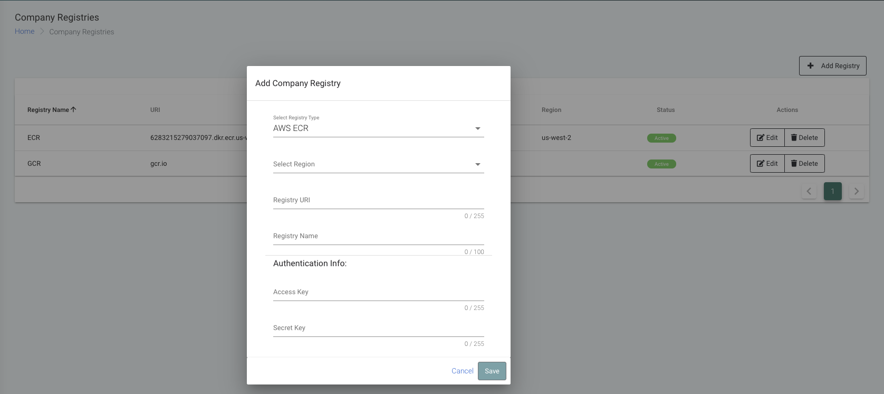
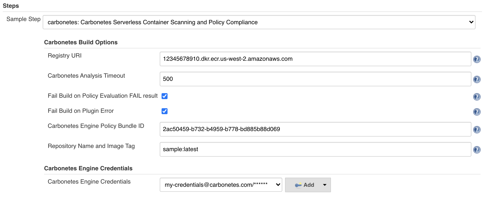
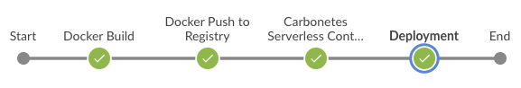

[](https://carbonetes.com)

***

# Table of Contents
- [Introduction](#introduction)
- [Prerequisites](#prerequisites)
  - [Managing Registries](#managing-registries)
- [Configuration](#configuration)
  - [Installation](#installation)
  - [Freestyle Job](#freestyle-job)
  - [Pipeline Syntax](#pipeline-syntax)
- [License](#license-and-copyright)

# Introduction
**Carbonetes Serverless Container Scanning and Policy Compliance** provides comprehensive container analysis and policy evaluation as a fully managed service. Carbonetes analyzes your container images for native code vulnerabilities, software composition analysis (SCA). license types, bill of materials, malware, secrets, and configuration. Carbonetes' powerful policy tool enables you to load standard policies or build , test and refine custom policies. It provides integrations with various container registries, CI/CD tools, as well as Slack and Jira.

Carbonetes' Jenkins Plug-in seamlessly integrates comprehensive container analysis directly into your CI/CD pipeline. Upon committing your code, the Jenkins plug-in automatically initiates a comprehensive container analysis scan. The results of that scan are compared to the applicable policy to determine whether the container should build or not. The insight from the analysis and the policy evaluation are embedded right inside Jenkins making it easy to find and resolve issues without ever leaving Jenkins.
***

# Prerequisites
 - The plugin requires a valid [Carbonetes](https://carbonetes.com) credentials (email and password).
### Managing Registries
 > After signing in to [Carbonetes](https://carbonetes.com), on the left sidebar, click on Container Registries. Then supply required fields and click save.

 


# Configuration

### Installation

 Install the plugin by navigating to **Manage Jenkins > Manage Plugins > Available** and search for `Carbonetes Serverless Container Scanning and Policy Compliance`

### Freestyle Job

1. Navigate to **Jenkins Dashboard > New Item > Freestyle Job** and you will be redirected to configuration.

2. Click on **Build Tab > Add build step > Choose** `Carbonetes Serverless Container Scanning and Policy Compliance`  

3. In the plugin configuration/snippet generator, 



> **Registry URI** the registry URI that is managed in [Carbonetes](https://carbonetes.com)

> **Carbonetes Analysis Timeout** the amount of time in seconds that the plugin will operate for comprehensive analysis.

> **Fail Build on Policy Evaluation FAIL result** if this is checked, the result of the **build** will fail if the result of policy evaluation is failed. Otherwise, ignored.

> **Fail Build on Plugin Error** if this is checked, the result of the **build** will fail if the plugin encounters error. Otherwise, ignored.

> **Carbonetes Engine Policy Bundle ID** upon signing in to [Carbonetes](https://carbonetes.com), on the left sidebar, click on policy bundles. Get the policy bundle ID of your desired bundle then click the copy icon and paste it in your plugin configuration. If left empty, the plugin will use an active one in the list.

> **Repository Name and Image Tag** ``` {repository_name:image_tag}``` from your container registry. 

*Note : to be aligned in your CI/CD pipeline, make sure that you supply the same repository:imagetag that has been built within your pipeline stages. See below sample pipeline stages.* 



> **Carbonetes Engine Credentials** the credentials that you use to sign in to Carbonetes.

# Pipeline Syntax

Below is a sample snippet to use Carbonetes plugin within a pipeline script. You can use the **Snippet Generator** to easily identify the plugin as a pipeline step.

```                
 script {
          carbonetes credentialsId: 'my-credentials', 
          engineTimeout: 500,
          failBuildOnPluginError: true, 
          failBuildOnPolicyEvaluationFailResult: true, 
          image: 'sample:latest', 
          policyBundleID: '2ac50459-b732-b4959-b778-bd885b88d069', 
          registryURI: '12345678910.dkr.ecr.us-west-2.amazonaws.com'
  } 
```

# License and Copyright

Copyright © 2020 Carbonetes

Licensed under [MIT License](LICENSE).
